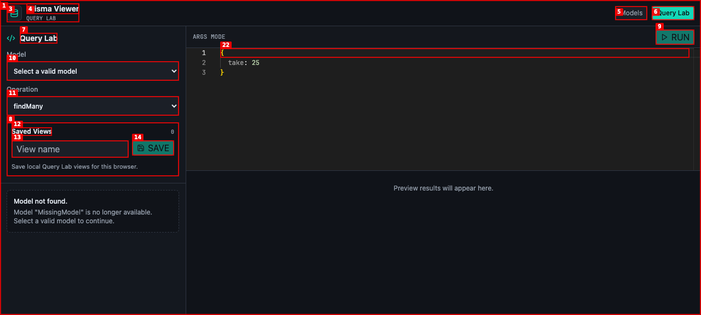
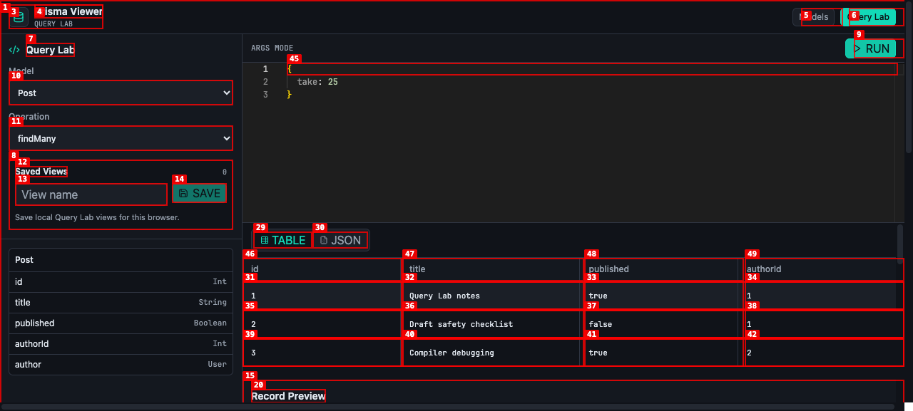

# Dogfood Report: Prisma Viewer Query Lab

| Field | Value |
|-------|-------|
| **Date** | 2026-05-28 |
| **App URL** | http://127.0.0.1:5174/ |
| **Session** | prisma-viewer-query-lab-qa |
| **Scope** | Query Lab end-to-end QA against the local Prisma fixture app |

## Summary

| Severity | Count |
|----------|-------|
| Critical | 0 |
| High | 0 |
| Medium | 2 |
| Low | 0 |
| **Total** | **2** |

## Issues

### ISSUE-001: Stale model route disables valid model recovery

| Field | Value |
|-------|-------|
| **Severity** | medium |
| **Category** | functional / ux |
| **URL** | http://127.0.0.1:5174/query-lab/MissingModel |
| **Repro Video** | N/A |

**Description**

Opening Query Lab with a model name that no longer exists shows the expected stale-model warning, but the model selector disables the valid `Post` and `User` options. The UI text says to select a valid model to continue, yet the control does not allow that recovery path. A user has to navigate away or manually edit the URL.

**Repro Steps**

1. Navigate directly to `http://127.0.0.1:5174/query-lab/MissingModel`.
   

2. Observe that the page says `Model "MissingModel" is no longer available. Select a valid model to continue.`, but the model dropdown contains disabled `Post` and `User` options and the Run button remains disabled.
   

---

### ISSUE-002: Default safety cap is presented as editor-provided input

| Field | Value |
|-------|-------|
| **Severity** | medium |
| **Category** | content / ux |
| **URL** | http://127.0.0.1:5174/query-lab |
| **Repro Video** | N/A |

**Description**

Running a default `Post.findMany` with an empty editor applies the safety `take: 25` cap, but the inspector says "All displayed args came from the editor input." That is misleading because the normalized args include a system-applied limit. Query Lab should distinguish editor input from safety defaults/caps so users can trust what was authored versus what was enforced.

**Repro Steps**

1. Open Query Lab and run the default `Post.findMany` query with the editor unchanged.
   

2. In Query Inspector, observe `Normalized Args` contains `{ "take": 25 }` while the explanatory text says all displayed args came from editor input.
   

---
